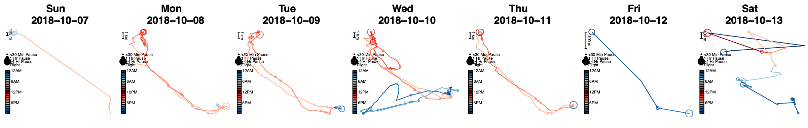

`r Sys.time()`

Author: [Cedric Huchuan Xia](https://www.pennlinc.io/team/Cedric-Huchuan-Xia) ([email](hxia@upenn.edu), [github](https://github.com/cedricx/))

Affiliation: Penn Lifespan Informatics and Neuroimaging Center ([PennLINC](pennlinc.io)) 

***


This *GPS Footprinting project* is inspired by [Finn et al. Nat Neuro  (2015)](https://www.nature.com/articles/nn.4135) and [Kaufmann et al. Nat Neuro (2015)](https://www.nature.com/articles/s41593-019-0471-7). These authors studied how personal differences in functional brain connectivity can identify individuals, mature during development, alter in neuropsychiatric illness, and differ between genders. The authors referred to these individual differences as *brain fingerprinting*.

> Here, we apply the fingerprinting technique to highly sampled GPS data in a clinical sample of youth. We are interested in how their individual mobility patterns can distinguish one another's identity, differ between genders, and alter in psychopathological groups. In other words, can our footprint tell us apart and something about our behavior? 

GPS data preprocessing was performed according to [Ian Barnett's imputation algorithm](https://github.com/ianjamesbarnett/SmartphoneSensorPipeline), originally published in [Biostatistics (2020)](https://academic.oup.com/biostatistics/article-abstract/21/2/e98/5145908).

### 1. Setup Environment 
```{r load_lib, message=FALSE}
require(ggplot2)
require(summarytools)
require(cowplot)
require(caret)
require(corrplot)
require(RColorBrewer)
require(vembedr)
require(Rmisc)
require(varian)
require(patchwork)
source('~/Documents/GitHub/SmartphoneSensorPipeline/Extra/plotting_functions.R')
```


```{r def_paths}
project_path = "~/Documents/xia_gps/"
data_path = file.path(project_path,"beiwe_output_043020")
gps_df_path = file.path(data_path,"Processed_Data/Group/feature_matrix.txt")
```

### 2. GPS Features
The current data has `r length(unique(gps_df$IID))` subjects, consisting of `r dim(gps_df)[1]` total days, and `r length(colnames(gps_df))-2` GPS features. To conserve battery life, a subject's GPS coordinates were tracked for in a 2-min-on and 18-min-off cycle everyday using their own mobile device via the [Beiwe platform](https://www.beiwe.org). We used [Ian Barnett's algorithm](https://github.com/ianjamesbarnett/SmartphoneSensorPipeline) to impute the missing data during the off cycles. Assuming no more data was missing due to various factors, one would generate `r 2*3*24` mins of GPS data per day, or `r 2/20*100`% of total minutes in a day. 

As you can see from the figure below, we can nicely reconstruct an individuals' mobility trajectory from these data.
<center>

**Figure 1: A weekly view of a subject's mobility pattern**
</center>

For an even more intuitive view of the GPS data, take a look at the video here:

<center>
```{r echo=FALSE}
embed_url("https://youtu.be/KobESgtfoOo")
```
</center>


 <br><br><br><br>

From these GPS traces, we extracted daily mobility features, such as *max home distance*, *circadian routine*, *probability of pauses*, as described in [Barnett et al., Biostatistics (2020)](https://academic.oup.com/biostatistics/article-abstract/21/2/e98/5145908) and defined mathematically in its [supplementary material](https://drive.google.com/open?id=1jHFJLXjUSwoserN5tPtA--h9GEcVfZ10).

To get a flavor of what these features look like, the first six days of GPS data for a subject are attached below. 
```{r read_gps}
gps_df = read.table(gps_df_path,header = T, dec = ",", )[,c(1,2,97:111)]

#Define the column types
gps_df$Date = as.Date(gps_df$Date)
gps_df[,3:dim(gps_df)[2]] = apply(gps_df[,3:dim(gps_df)[2]], 2, function(x) as.numeric(x))
head(gps_df)

```

### 3. Exclude Data
The first step before further analysis is to exclude data points (days) that had excessive amount of data missing. Here is a historgram of the minutes missing for all `r dim(gps_df)[1]` total days. 

```{r echo=TRUE, fig.height=4, fig.width=10, message=FALSE, warning=FALSE}
p=minMiss_histplot(gps_df,200, "All Data")
ggplotly(p)
```
**Figure 2: Minutes missing for all collected days.** There are `r dim(gps_df)[1]` total days. Dashlines indicate the corresponding percentile.


#### 3a.  remove first and last days
First, we will remove the first and last days from each subject, because the application was installed during mid-day at the beginning of the study and uninstalled mid-day at the end of the study. 

```{r 1st_last_days}
# loop through each subj to remove 1st and last days of gps data
gps_df_clean = data.frame() #initiate a df
for (subj in unique(gps_df$IID)){ #loop through each subj
  gps_df_subj <- subset(gps_df, IID == subj) #get gps_df per subject
  gps_df_subj <- gps_df_subj[2:(dim(gps_df_subj)[1]-1),] #remove the 1st and last days
  gps_df_clean <- rbind(gps_df_clean,gps_df_subj) #combine all subjs
}
```

This step removed `r dim(gps_df)[1] - dim(gps_df_clean)[1]` days. Now, dataset has `r length(unique(gps_df_clean$IID))` subjects, consisting of `r dim(gps_df_clean)[1]` total days, and `r length(colnames(gps_df_clean))-2` GPS features.

```{r fig.width=10, fig.height=4, echo=FALSE}
p=minMiss_histplot(gps_df_clean,200, "After Removing 1st and Last Days")
ggplotly(p)
```
**Figure 3: Minutes missing after removing the first and last days of each subject.** There are `r dim(gps_df_clean)[1]` total days. Dashlines indicate the corresponding percentile.

#### 3b.  remove days at the sensitivity threshold
Next, we are removing the days with excessive data missingness. This is of course an arbitrary step. Therefore we will conduct a sensitivity analysis of the missingness threshold we set by performing the analysis across multiple different thresholds. For now, the current sensitivity cutoff is set at `r sensitivity_cutoff`, which amounts to only excluding those with `r sensitivity_cutoff/1440*100`% of GPS missing.

```{r results='asis'}
sensitivity_cutoff = 1440 # this controls the cutoff threshold
gps_df_clean2 = subset(gps_df_clean, MinsMissing < sensitivity_cutoff)
```

This step removed `r dim(gps_df_clean)[1] - dim(gps_df_clean2)[1]` days. Now, dataset has `r length(unique(gps_df_clean2$IID))` subjects, consisting of `r dim(gps_df_clean2)[1]` total days, and `r length(colnames(gps_df_clean2))-2` GPS features.

```{r fig.width=10, fig.height=4, echo=FALSE}
p = minMiss_histplot(gps_df_clean2,200, paste("After Removing Missing Greater than ",sensitivity_cutoff))
ggplotly(p)
```
**Figure 4: Minutes missing after removing days with all data missing.** There are `r dim(gps_df_clean2)[1]` total days. Dashlines indicate the corresponding percentile.


```{r fig.width=10, fig.height=4, echo=FALSE}
p = minMiss_histplot(subset(gps_df_clean2,MinsMissing>=1296),200, "Zoom In Plot")
ggplotly(p)
```
**Figure 5: A Zoom-in plot of minutes missing distribution after removing days with all data missing.** There are `r dim(gps_df_clean2)[1]` total days. Dashlines indicate the corresponding percentile.

### 4. Random Data Partitions

To operationalize individual footprinting prediction, we randomly split each individual's available GPS data to two half partitions for `r part_times` times. We used the features from the first half to determine if we can identify the same individual using their data in the second unseen half. Again, to avoid any (un)lucky random splits, we repeated data partition `r part_times` times.

```{r}
set.seed(510)
make_subj_seq = function(gps_df_clean2,part_times = 10) {
  subj_seq = list()
  for (subj in unique(gps_df_clean2$IID)){
    subj_data = subset(gps_df_clean2, IID==subj)
    subj_seq[[subj]] <-createDataPartition(subj_data$IID,times = part_times, p =0.5)
  }
  return(subj_seq)
}
subj_seq = make_subj_seq(gps_df_clean2, 100)

```


### 5. Build Correlation Matrix

Here, similar to [Finn et al. Nat Neuro  (2015)](https://www.nature.com/articles/nn.4135) and [Kaufmann et al. Nat Neuro (2015)](https://www.nature.com/articles/s41593-019-0471-7), we built a Pearson correlation matrix among `r length(colnames(gps_df_clean2))-2` available GPS features. Below is an illustrative sample of the variables and their correlations.

```{r example_cor_fig, fig.width=3, fig.width=3, fig.align="center"}
# an example of subj 1, and first half
example_data = gps_df_clean2[subj_seq$`14w5qlo8`$Resample001,3:17]
gps_cor = rquery.cormat(example_data, type = "full")

```
**Figure 6: Correlation matrix of GPS features for a subject.**


We then calculated the feature matrix for all `r length(unique(gps_df_clean2$IID))` subjects in the dataset, seperately for each half data partition, and for each random split. 

```{r create feature matrix for everyone, warning=FALSE}
make_feature_matrix = function(gps_df, subj_seq) {
  subj_mat_1 = list()
  subj_mat_2 = list()
  for (subj in unique(gps_df$IID)){
    subj_data = subset(gps_df_clean2, IID==subj)
    subj_mat_1[[subj]] = lapply(subj_seq[[subj]], function(list) rquery.cormat(subj_data[list,3:17], type = "flatten", graph = F)$r)
    subj_mat_2[[subj]] = lapply(subj_seq[[subj]], function(list) rquery.cormat(subj_data[-list,3:17], type = "flatten", graph = F)$r)
  }
  return(list(subj_mat_1 = subj_mat_1, subj_mat_2 = subj_mat_2 ))
}

gps_clean2_feature = make_feature_matrix(gps_df_clean2)
```

### 6. Match Target

Next we tried to match each target, defined by one subject's feature matrix in the first half, to a feature matrix in the second half in the same random split. If the same individual's feature matrix in the second half had the highest correlation among all subjects, then we assigned the match result 1, indicating a succussful match, otherwise 0, indicating an unsccussful match.

```{r calc match cor}
# creating a "database" against which target is to be matched with
subj_mat_1 = gps_clean2_feature$subj_mat_1
subj_mat_2 = gps_clean2_feature$subj_mat_2

calc_match_cor = function(subj_mat_1,subj_mat_2) {
  part_times = length(subj_mat_1[[1]])
  database = list() 
  for (time in 1:part_times) {
      database[[time]] = lapply(subj_mat_2, function(subjmat) subjmat[[time]]$cor)
  }
  
    # match target to database
    match_cor = list()
    for (subj1 in names(subj_mat_1)){ #loop through each subj
      # create a list of target across partitions
      target_list = lapply(subj_mat_1[[subj1]], function(part) part$cor)
      # create a match list
      for (time in 1:part_times){
        target_subj_time = target_list[[time]] #loop through each partition
        for (subj2 in names(subj_mat_2)){ #loop everyone in 2nd half
          data_subj_time = subj_mat_2[[subj2]][[time]]$cor
          match_cor[[subj1]][[as.character(time)]][[subj2]] = cor(target_subj_time,data_subj_time,use = "na.or.complete")
        }
      }
    }
  return(match_cor)
}

match_cor = calc_match_cor(subj_mat_1,subj_mat_2)

```


By tallying up all the successful and unsuccessful matchs in each of the `r part_times` random splits, we calculated a distribution of match accuracy.

```{r calc accuracy by partition}
calc_acc_time=function(match_cor,part_times) {
  acc_time = array()
  for (time in 1:part_times){
    acc_time[time] = 0
    for (subj in names(subj_mat_1)){
      max_position = which.max(unlist(match_cor[[subj]][[as.character(time)]]))
      predicted_subj = names(subj_mat_1)[max_position]
      if (predicted_subj == subj) {
        acc_time[time] = acc_time[time] + 1
      }
    }
  }
  acc_time = acc_time/length(names(subj_mat_1))
  return(acc_time)
}
acc_time = calc_acc_time(match_cor,part_times)
```

Over the `r part_times` random splits, the mean match accuracy was `r round(mean(acc_time),4)*100`%, with a standard deviation of `r round(sd(acc_time),4)*100`%, high of `r round(max(acc_time),4)*100`%, and low of `r round(min(acc_time),4)*100`%, (95%CI: `r round(CI(acc_time)['lower'],2)`-`r round(CI(acc_time)['upper'],2)`).

```{r plot accuracy by partition histogram, fig.width=8, fig.height=4}
p_time_cor = hist_chx(acc_time, bins = 15, title = paste("Correlated Features: \n Average Accuracy Across",part_times,"Data Partitions"), xaxis = "Prediction Accuracy", yaxis = "Count")
ggplotly(p_time_cor)
```
**Figure 7: Match accuracy distributon across `r part_times` data splits.** Mean match accuracy was `r round(CI(acc_time)['mean'],2)` (95%CI: `r round(CI(acc_time)['lower'],2)`-`r round(CI(acc_time)['upper'],2)`)


```{r calc accuracy by subj}
calc_acc_subj = function(match_cor, part_times){
  acc_subj = array()
  for (subj in names(subj_mat_1)){
    acc_subj[subj] = 0
    for (time in 1:part_times){
      max_position = which.max(unlist(match_cor[[subj]][[as.character(time)]]))
      predicted_subj = names(subj_mat_1)[max_position]
      if (predicted_subj == subj) {
        acc_subj[subj] = acc_subj[subj] + 1
      }
    }
  }
  acc_subj = acc_subj/part_times
  acc_subj = acc_subj[-1]
  return(acc_subj)
}
acc_subj = calc_acc_subj(match_cor, part_times)
```


In addition to the match accuracy across subjects, we also calculated the match accuracy for each individual. Across the `r length(unique(gps_df_clean2$IID))` subjects, the mean match accuracy was `r round(mean(subj_df$y),4)*100`%, with a standard deviation of `r round(sd(subj_df$y),4)*100`%, high of `r round(max(subj_df$y),4)*100`%, and low of `r round(min(subj_df$y),4)*100`%.

```{r plot accuracy by subjects, fig.width=8, fig.height=4}
subj_scatter  = function(gps_df, acc_subj_vector, method){
  subj_df <- data.frame(x=unique(gps_df$IID))
  subj_df$y = acc_subj_vector
  subj_df = subj_df[order(subj_df$y),]
  subj_acc_plot = ggplot(subj_df) + 
  geom_point(aes(x = reorder(x, y), y = y)) + 
   theme_cowplot() + 
    labs(title = paste(method,"Features \n Subject Level Accuracy Across",part_times,"Data Partitions"), 
       x = "Subjects", y = "Prediction Accuracy") +
   theme(axis.text.x = element_text(angle = 45, hjust = 1, size = 8), plot.title = element_text(hjust = 0.5))
  return(subj_acc_plot)
}

ggplotly(subj_scatter(gps_df_clean2,acc_subj, "Correlated"))
```
**Figure 8: Match accuracy distributon across `r length(unique(gps_df_clean2$IID))` subjects.** Mean match accuracy was `r round(mean(subj_df$y),4)*100`%, with a standard deviation of `r round(sd(subj_df$y),4)*100`%, high of `r round(max(subj_df$y),4)*100`%, and low of `r round(min(subj_df$y),4)*100`%. This shows dramatic differences in individual *footprinting distinctiveness*.


### 7. Permutation Test

To assess the statistical significance of the results above, we conducted a non-parametric permutation test. To do this, we randomly scrambled pair-wise subject-to-day linkage. We repeated this process `r perm_time` times, and followed the same procedure as above to obtain a null distribution of average match accuracy across sample, and for each individual.

```{r calc permutation accuracy, echo=TRUE, message=FALSE, warning=FALSE}
gps_df_perm = gps_df_clean2
perm_time = 1000
perm_acc_time = list()
perm_acc_subj = list()
for (i in 1:perm_time) {
  perm_part_times = 1
  print(paste("processing ...", i,"..."))
  gps_df_perm$IID = sample(gps_df_perm$IID)
  perm_subj_seq = make_subj_seq(gps_df_perm,part_times = perm_part_times)
  perm_gps = make_feature_matrix(gps_df_perm,perm_subj_seq)
  perm_mat_1 = perm_gps$subj_mat_1
  perm_mat_2 = perm_gps$subj_mat_2
  perm_match_cor = calc_match_cor(perm_mat_1,perm_mat_2)
  perm_acc_time[[i]] = calc_acc_time(perm_match_cor,part_times = perm_part_times)
  perm_acc_subj[[i]] = calc_acc_subj(perm_match_cor,part_times = perm_part_times)
}
```


Over the `r perm_time` permutations, the mean match accuracy was `r round(mean(perm_acc_time_all),4)*100`%, with a standard deviation of `r round(sd(perm_acc_time_all),4)*100`%, high of `r max(mean(perm_acc_time_all),4)*100`%, and low of `r min(mean(perm_acc_time_all),4)*100`%.(95%CI: `r round(CI(perm_acc_time_all)['lower'],2)`-`r round(CI(perm_acc_time_all)['upper'],2)`)

```{r combine partition permutation results, fig.width=8, fig.height=4}
perm_acc_time_all = unlist(perm_acc_time)
q_time_cor = hist_chx(perm_acc_time_all, bins = 8, title = paste("Average Accuracy Across",length(perm_acc_time_all),"Permutations"), xaxis = "Prediction Accuracy", yaxis = "Count")
ggplotly(q_time_cor)
```
**Figure 9: Match accuracy distributon across `r perm_time` permutations.** Mean match accuracy in permutation was `r round(CI(perm_acc_time_all)['mean'],2)` (95%CI: `r round(CI(perm_acc_time_all)['lower'],2)`-`r round(CI(perm_acc_time_all)['upper'],2)`). This null distribution does not overlapp with the distributon using real data (**Fig.7**) at all.


We also calculated null distribution of match accuracy for each subject. Over the `r perm_time` permutations, the mean match accuracy was `r round(mean(subj_df$y_perm),4)*100`%, with a standard deviation of `r round(sd(subj_df$y_perm),4)*100`%, high of `r round(max(subj_df$y_perm),4)*100`%, and low of `r round(min(subj_df$y_perm),4)*100`%.

```{r combine subj permutation analysis}
perm_subj = list()
for (subj in subj_acc_plot$data$x) {
  perm_subj$val[[subj]] = sapply(perm_acc_subj, function(perm) perm[which(names(perm) == subj)])
  perm_subj$hist[[subj]] = hist_chx(perm_subj[[subj]]$val, bins = 8, title = paste(subj,": Accuracy Across \n",perm_time,"Permutations"), xaxis = "Prediction Accuracy", yaxis = "Count")
  perm_subj$acc[[subj]] = sum(perm_subj$val[[subj]])/perm_time
}
```

```{r plot subj analysis with perm, fig.width=8, fig.height=4}
subj_df <- data.frame(x=unique(gps_df_clean2$IID))
subj_df$y = acc_subj
subj_df$y_perm = unlist(perm_subj$acc)
subj_df = subj_df[order(subj_df$y),]
p_subj_cor_perm = ggplot(subj_df, aes(x = reorder(x, y), y = value)) + 
  geom_point(aes(y = y, col = "subject data")) + 
  geom_point(aes(y = y_perm, col = "permutation")) +
  theme_cowplot() + 
  labs(title = paste("Cor Features \n Subject Level Accuracy Across",part_times,"Data Partitions"), 
       x = "Subjects", y = "Prediction Accuracy") +
  theme(axis.text.x = element_text(angle = 45, hjust = 1, size = 8), plot.title = element_text(hjust = 0.5))
ggplotly(p_subj_cor_perm)
```
**Figure 8: Match accuracy null distributon across `r length(unique(gps_df_clean2$IID))` subjects.** Mean match accuracy in permutation was `r round(mean(subj_df$y_perm),4)*100`%, with a standard deviation of `r round(sd(subj_df$y_perm),4)*100`%, high of `r round(max(subj_df$y_perm),4)*100`%, and low of `r round(min(subj_df$y_perm),4)*100`%. While individuals exhibited marked differences in footprinting distinctivenss, the subject with the lowest prediction accuracy was still statistically significant against the permutation test (i.e. for subject `r subj_df$x[1]`: data: `r round(min(subj_df$y),4)*100` % vs. permutation: `r round(min(subj_df$y_perm),4)*100`%).


### 8. Mean Features

We calculated the `mean` of each GPS feature as a metric of feature variability. Similar to above, we calculated `mean` separately for each data partition and for each individual.

```{r calc mean GPS features}
mean_gps = function(gps_df){
  mean_list = sapply(3:17,function(i) mean(gps_df[,i],na.rm=T))
  names(mean_list) = colnames(gps_df)[3:17]
  return(mean_list)
}

make_feature_mean = function(gps_df, subj_seq) {
  subj_mat_1 = list()
  subj_mat_2 = list()
  for (subj in unique(gps_df$IID)){
    subj_data = subset(gps_df_clean2, IID==subj)
    subj_mat_1[[subj]] = lapply(subj_seq[[subj]], function(list) mean_gps(subj_data[list,]))
    subj_mat_2[[subj]] = lapply(subj_seq[[subj]], function(list) mean_gps(subj_data[-list,]))
  }
  return(list(subj_mat_1 = subj_mat_1, subj_mat_2 = subj_mat_2 ))
}

gps_clean2_mean_feat = make_feature_mean(gps_df_clean2, subj_seq)
```

```{r warp mean feature list to data frame, fig.height=6, echo=F}
mean_df = list()
for (subj in unique(gps_df$IID)) {
  mean_df[[subj]] = data.frame(matrix(NA, part_times, length(colnames(gps_df_clean))-2))
  for (i in 1:part_times){
    mean_df[[subj]][i,] = gps_clean2_mean_feat$subj_mat_1[[subj]][[i]]
  }
  colnames(mean_df[[subj]]) = colnames(gps_df_clean[3:17])
}

mean_plots = list()
for (gps_ft in colnames(gps_df_clean[3:17])){
  mean_plots[[gps_ft]] = hist_chx(sapply(mean_df, function(df) df[1,gps_ft]), title = gps_ft, xaxis = "Feature Mean", yaxis = "count")
}

Reduce(`+`, mean_plots)
```
**Figure 9: Feature mean across all subjects**. The histogram are for data in the first random half split.


### 9. Variability Features
We calculated the `root mean square of successive differences` or `RMSSD` of each GPS feature as a metric of feature variability. Similar to above, we calculated `RMSSD` separately for each data partition and for each individual.

```{r calculate variability features}
rmssd_gps = function(gps_df){
  rmssd_list = sapply(3:17,function(i) rmssd_id(gps_df[,i], gps_df$IID,long=F))
  names(rmssd_list) = colnames(gps_df)[3:17]
  return(rmssd_list)
}

make_feature_rmssd = function(gps_df, subj_seq) {
  subj_mat_1 = list()
  subj_mat_2 = list()
  for (subj in unique(gps_df$IID)){
    subj_data = subset(gps_df_clean2, IID==subj)
    subj_mat_1[[subj]] = lapply(subj_seq[[subj]], function(list) rmssd_gps(subj_data[list,]))
    subj_mat_2[[subj]] = lapply(subj_seq[[subj]], function(list) rmssd_gps(subj_data[-list,]))
  }
  return(list(subj_mat_1 = subj_mat_1, subj_mat_2 = subj_mat_2 ))
}

gps_clean2_rmssd_feat = make_feature_rmssd(gps_df_clean2, subj_seq)
```

```{r warp var feature list to data frame, fig.height=6, echo=F}
var_df = list()
for (subj in unique(gps_df$IID)) {
  var_df[[subj]] = data.frame(matrix(NA, part_times, length(colnames(gps_df_clean))-2))
  for (i in 1:part_times){
    var_df[[subj]][i,] = gps_clean2_rmssd_feat$subj_mat_1[[subj]][[i]]
  }
  colnames(var_df[[subj]]) = colnames(gps_df_clean[3:17])
}

var_plots = list()
for (gps_ft in colnames(gps_df_clean[3:17])){
  var_plots[[gps_ft]] = hist_chx(sapply(var_df, function(df) df[1,gps_ft]), title = gps_ft, xaxis = "Feature Variability(RMSSD)", yaxis = "count")
}

Reduce(`+`, var_plots)
```
**Figure 10: Feature variability for all subjects**. Variability is measured by `root mean square of successive differences` (RMSSD). The histograms are for data in the first random half split.


### 10. Predict with New Features 
```{r define match function for vector features}
calc_match_vector = function(subj_mat_1,subj_mat_2) {
  part_times = length(subj_mat_1[[1]])
  database = list() 
  for (time in 1:part_times) {
      database[[time]] = lapply(subj_mat_2, function(subjmat) subjmat[[time]])
  }
  
    # match target to database
    match_cor = list()
    for (subj1 in names(subj_mat_1)){ #loop through each subj
      # create a list of target across partitions
      target_list = lapply(subj_mat_1[[subj1]], function(part) part)
      # create a match list
      for (time in 1:part_times){
        target_subj_time = target_list[[time]] #loop through each partition
        for (subj2 in names(subj_mat_2)){ #loop everyone in 2nd half
          data_subj_time = subj_mat_2[[subj2]][[time]]
          match_cor[[subj1]][[as.character(time)]][[subj2]] = cor(target_subj_time,data_subj_time,use = "na.or.complete")
        }
      }
    }
  return(match_cor)
}
```


```{r calc match accuracy using mean features}
match_mean = calc_match_vector(gps_clean2_mean_feat$subj_mat_1,gps_clean2_mean_feat$subj_mat_2)
acc_time_mean = calc_acc_time(match_mean,part_times)
acc_subj_mean = calc_acc_subj(match_mean, part_times)
```

```{r calc match accuracy using variability features}
match_rmssd = calc_match_vector(gps_clean2_rmssd_feat$subj_mat_1,gps_clean2_rmssd_feat$subj_mat_2)
acc_time_rmssd = calc_acc_time(match_rmssd,part_times)
acc_subj_rmssd = calc_acc_subj(match_rmssd, part_times)
```

### 11. Permutation Tests with New Features 

#### 11a. Average Accuracy
```{r define new permutation functions}
perm_vector = function(gps_df, perm_time, method){
  gps_df_perm = gps_df
  perm_acc_time = list()
  perm_acc_subj = list()
  for (i in 1:perm_time) {
    perm_part_times = 1
    print(paste("processing ...", i,"..."))
    gps_df_perm$IID = sample(gps_df_perm$IID)
    perm_subj_seq = make_subj_seq(gps_df_perm,part_times = perm_part_times)
    if (method == "rmssd") {
      perm_gps = make_feature_rmssd(gps_df_perm,perm_subj_seq)
    } else if (method == "mean"){
      perm_gps = make_feature_mean(gps_df_perm,perm_subj_seq)
    }
    perm_mat_1 = perm_gps$subj_mat_1
    perm_mat_2 = perm_gps$subj_mat_2
    perm_match_cor = calc_match_vector(perm_mat_1,perm_mat_2)
    perm_acc_time[[i]] = calc_acc_time(perm_match_cor,part_times = perm_part_times)
    perm_acc_subj[[i]] = calc_acc_subj(perm_match_cor,part_times = perm_part_times)
  }
  return(list(perm_acc_time= perm_acc_time,perm_acc_subj = perm_acc_subj))
}
```


```{r run permutation for mean features, fig.width= 6, message=FALSE}
#perm_mean = perm_vector(gps_df_clean2, 1000, "mean")

p_time_mean = hist_chx(acc_time_mean, bins = 8, title = paste("Mean Features: \n Average Accuracy Across",length(acc_time_mean),"Data Partitions"), xaxis = "Prediction Accuracy", yaxis = "Count")

q_time_mean =  hist_chx(unlist(perm_mean$perm_acc_time), bins = 8, title = paste("Mean Features: \n Average Accuracy Across",length(perm_mean$perm_acc_time),"Permutations"), xaxis = "Prediction Accuracy", yaxis = "Count")

p_time_mean + q_time_mean
```


```{r run permutation for rmssd features, fig.width= 6, message=FALSE}
#perm_rmssd = perm_vector(gps_df_clean2, 1000, "rmssd")

p_time_rmssd = hist_chx(acc_time_rmssd, bins = 8, title = paste("RMSSD Features: \n Average Accuracy Across",length(acc_time_rmssd),"Data Partitions"), xaxis = "Prediction Accuracy", yaxis = "Count")

q_time_rmssd = hist_chx(unlist(perm_rmssd$perm_acc_time), bins = 8, title = paste("RMSSD Features: Average Accuracy Across",length(perm_mean$perm_acc_time),"Permutations"), xaxis = "Prediction Accuracy", yaxis = "Count")

p_time_rmssd + q_time_rmssd
```

```{r define combine perm subj functions}

combine_perm_subj = function(acc_subj_plot, perm_acc_subj) {
  perm_subj = list()
  for (subj in acc_subj_plot$data$x) {
    perm_subj$val[[subj]] = sapply(perm_acc_subj, function(perm) perm[which(names(perm) == subj)])
    perm_subj$hist[[subj]] = hist_chx(perm_subj[[subj]]$val, bins = 8, title = paste(subj,": Accuracy Across \n",perm_time,"Permutations"), xaxis = "Prediction Accuracy", yaxis = "Count")
    perm_subj$acc[[subj]] = sum(perm_subj$val[[subj]])/perm_time
  }
  return(perm_subj)
}


subj_scatter_perm = function(gps_df,acc_subj,perm_subj, method){
    subj_df <- data.frame(x=unique(gps_df$IID))
  subj_df$y = acc_subj
  subj_df$y_perm = unlist(perm_subj$acc)
  subj_df = subj_df[order(subj_df$y),]
  p = ggplot(subj_df, aes(x = reorder(x, y), y = value)) + 
    geom_point(aes(y = y, col = "subject data")) + 
    geom_point(aes(y = y_perm, col = "permutation")) +
    theme_cowplot() + 
    labs(title = paste(method,"Features \n Subject Level Accuracy Across",part_times,"Data Partitions"), 
         x = "Subjects", y = "Prediction Accuracy") +
    theme(axis.text.x = element_text(angle = 45, hjust = 1, size = 8), plot.title = element_text(hjust = 0.5))
  return(p)
}

```


```{r mean features by subject with permutation}
p_subj_mean = subj_scatter(gps_df_clean2, acc_subj_mean, "Mean")
perm_subj_mean = combine_perm_subj(p_subj_mean,perm_mean$perm_acc_subj)
p_subj_mean_perm = subj_scatter_perm(gps_df_clean2, acc_subj_mean, perm_subj_mean, "Mean")
ggplotly(p_subj_mean_perm)
```

```{r rmssd features by subject with permutation}
p_subj_rmssd = subj_scatter(gps_df_clean2, acc_subj_rmssd, "RMSSD")
perm_subj_rmssd = combine_perm_subj(p_subj_rmssd,perm_rmssd$perm_acc_subj)
p_subj_rmssd_perm = subj_scatter_perm(gps_df_clean2, acc_subj_rmssd, perm_subj_rmssd, "RMSSD")
ggplotly(p_subj_rmssd_perm)
```


### 12. Compare Features
```{r compare across data partition, fig.width=8}
p_time_cor + p_time_mean + p_time_rmssd
```

```{r compare across subjects, fig.height=6, fig.width=4}
p_subj_cor_perm / p_subj_mean_perm / p_subj_rmssd_perm
```

### 13. Combine Features

### 14. Misc Info
```{r message=FALSE, warning=FALSE}
#sessionInfo()
```

